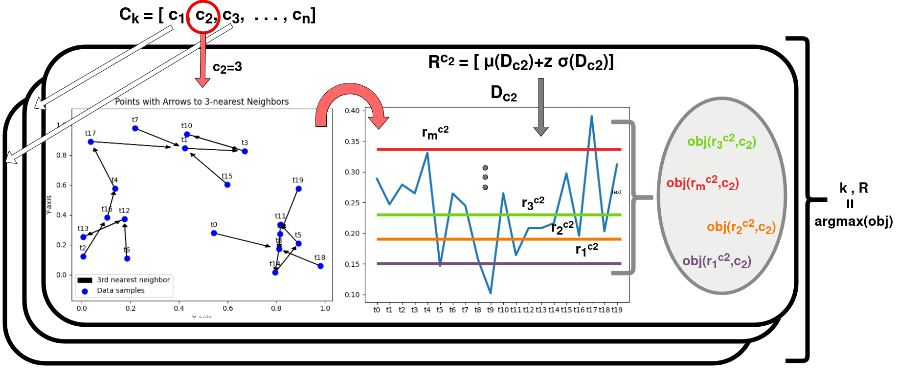
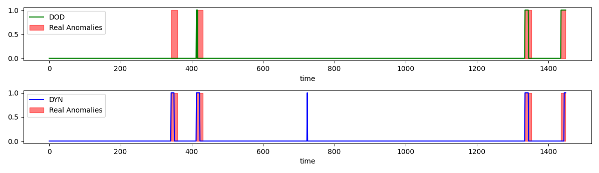

# Parameter-free Streaming Distance-based \\Outlier Detection

### Automatic  Distance Based Outlier Detection

Implementation of Distance Based outlier detection (DOD) baseline and dynamic K and R alternative (Dyn).

Dyn method calculates best k and R parameter in each window, based on objective function:



# Usage (main.py)

```python
X_data, label=data_and_labels(sequence_len=10,dataset="./data/YAHOO/Yahoo_A1real_53_data.out")


# Application of generating score in online fashion for all data, applyig sliding window:
dod_clf = DOD(k=50, R=10, window=200, slide=100)
dyn_clf = Dyn(window=200, slide=100)

DOD_anomalies=dod_clf.fit(X_data)
Dyn_anomalies=dyn_clf.fit(X_data)

plot(DOD_anomalies, Dyn_anomalies, label)
```
Output: 

# Folder Structure and scripts:

`main.py`: Example of usage of the two algorithms in online fashion.

`ExperimentTSB.py`: a helper class to conduct experiments using the two algorithms.
`RunExperiments.py`: Tesing multiple hyper-parameters for DOD and Dyn and store the results under `resulst` Folder (`results_final.csv` file for Dyn and `resultsKR_final.csv` for DOD).
`/results/readResults.py`: Used to search results from DOD and Dyn experiment, and to produce plot with summarized results.

`data/` : data used for the evaluation
`Techniques/` : Implementation of Dyn and DOD


### TSB-UAD usage: 

We use Window functionality to transform uni-variate to multivariate data using sub-sequences, using TSB implementation under the foldt `TSB_UAD_code/`.

Reference:

```commandline
@article{paparrizos2022tsb,
  title={Tsb-uad: an end-to-end benchmark suite for univariate time-series anomaly detection},
  author={Paparrizos, John and Kang, Yuhao and Boniol, Paul and Tsay, Ruey S and Palpanas, Themis and Franklin, Michael J},
  journal={Proceedings of the VLDB Endowment},
  volume={15},
  number={8},
  pages={1697--1711},
  year={2022},
  publisher={VLDB Endowment}
}
```
